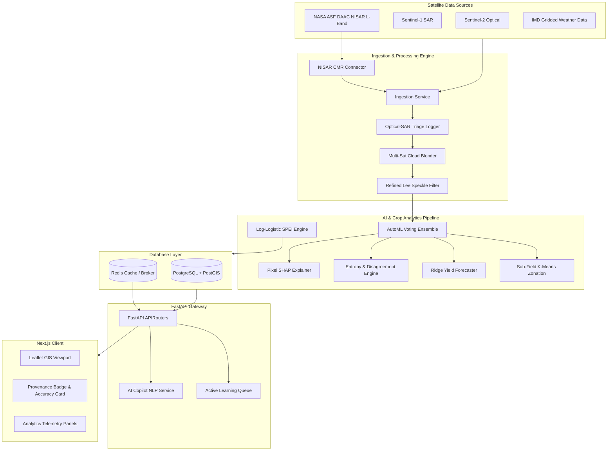

# 🌾 KISAN DRISHTI (किसान दृष्टि) 🛰️
### AI-Driven Satellite Crop Intelligence & Precision Irrigation Advisory Platform

[]()
[]()
[]()
[]()
[]()
[]()

**Kisan Drishti** (किसान दृष्टि — "Farmer's Vision") is a production-grade, nationally scalable geospatial AI platform that fuses optical (Sentinel-2, Landsat-8/9, MODIS) and microwave SAR (Sentinel-1, NISAR ready) satellite observations to perform automated crop type classification, phenology-aware moisture stress detection, crop water deficit estimation, and precision irrigation advisories.

---

## 📖 Table of Contents
1. [Core Architecture & Technical Stack](#-core-architecture--technical-stack)
2. [Deep-Dive: The 20 Innovation Features](#-deep-dive-the-20-innovation-features)
3. [Remote Sensing & Mathematical Formulations](#-remote-sensing--mathematical-formulations)
4. [Database & Spatial Persistence (PostGIS)](#-database--spatial-persistence-postgis)
5. [FastAPI Backend Service Layer](#-fastapi-backend-service-layer)
6. [Next.js GIS Frontend & Dashboard](#-nextjs-gis-frontend--dashboard)
7. [Installation & Local Deployment](#-installation--local-deployment)
8. [API v1 Endpoint Directory](#-api-v1-endpoint-directory)
9. [Automated Test Suite](#-automated-test-suite)

---

## 🛠️ Core Architecture & Technical Stack



### Stack Components:
- **Backend Framework**: `FastAPI` (Python 3.11/3.14 compatible) providing high-performance, asynchronous REST APIs.
- **Geospatial Processing**: `GDAL`, `Fiona`, `PyProj`, `Rasterio`, `Shapely`, and `GeoPandas` for robust raster manipulation, polygon clipping, coordinate transformation, and spatial analytics.
- **Machine Learning**: `Scikit-Learn`, `XGBoost`, `SHAP`, `SciPy`, and `NumPy` for training AutoML ensembles, crop zonation, yield forecasting, and explainability metrics.
- **Database Layer**: `PostgreSQL 15` with `PostGIS` extension for geometry queries, indexed spatial overlays, and timeseries tables.
- **Caching & Tasks**: `Redis 7` acting as a database query caching layer and broker for asynchronous task distribution via `Celery`.
- **Frontend App**: `Next.js 15` + `React 19` using `TypeScript`, `Tailwind CSS`, and `Leaflet Map` for interactive GIS mapping.

---

## 🌟 Deep-Dive: The 20 Innovation Features

### 🛡️ Theme A: Trust & Explainability
1. **Pixel-Level SHAP Attributions**: Uses the tree-based XGBoost model from the ensemble classifier to calculate SHAP feature attributions, explaining exactly which temporal/spectral signals (e.g. SWIR bands in week 4) contributed to identifying the crop type.
2. **Predictive Entropy Maps**: Computes information entropy ($-\sum p_i \log p_i$) across classifier prediction probabilities to flag low-confidence spatial borders.
3. **Model Disagreement Index**: Identifies variance in predicted crop distributions by evaluating cosine similarity margins between Random Forest and XGBoost predictions.
4. **Causal Gating Explanations**: Intercepts moisture stress alerts using a causal validation engine that checks if decreased NDVI is due to water stress or natural crop maturity/senescence.

### ☀️ Theme B: Drought & Climate Intelligence
5. **Log-Logistic SPEI Engine**: Implements the Standardized Precipitation Evapotranspiration Index using a 3-parameter Log-Logistic distribution fitted to historical Precip-ET0 water balance records.
6. **NDVI Z-Score Anomaly Stacks**: Compares current weekly pixel-level NDVI values against multi-year historical means and standard deviations to locate anomalies.
7. **Retrospective Lead-Time Scorer**: Back-tests stress detection models to measure early-warning lead-times before ground truth flags appear.

### 💰 Theme C: Economic Translation
8. **Ridge Yield Forecaster**: Fuses growing-season cumulative NDVI integrals and Growing Degree Days (GDD) using crop-specific Ridge regression weights.
9. **ROI Savings Engine**: Tracks and displays financial and volumetric water savings compared to traditional flood irrigation baselines.
10. **PMFBY Loss Evidence Generator**: Generates stage-weighted yield-loss records for PMFBY crop insurance claims and secures them with a SHA-256 validation hash to prevent tamper attempts.

### 🗺️ Theme D: Spatial Intelligence
11. **Sub-Field Zonation**: Clusters pixel vectors into 2-4 management sub-zones using unsupervised K-Means.
12. **SAR Irrigated Extent Refinement**: Outlines actual irrigated areas using Sentinel-1 backscatter drops and detects discrepancies compared to official administrative command area boundaries.
13. **Crop Rotation Streak Tracker**: Evaluates multi-season crop classifications to identify cropping streaks and flag fields without fallow breaks.

### 📢 Theme E: Farmer-Facing Accessibility
14. **Bilingual TTS Synthesizer**: Converts text advisories into MP3 files in Hindi and English using the `gTTS` library.
15. **Rain-Aware Advisory Deferral**: Automatically downgrades or defers irrigation suggestions if heavy rain is forecast in the 3-day window.
16. **Active Learning Feedback Loops**: Captures farmer feedback and automatically prioritizes fields with repeated disagreements for model retraining.

### ⚙️ Theme F: Operational Robustness
17. **Optical-SAR Fallback Triage**: Logs cloud cover and automatically switches to C-band/L-band radar indices (VV/VH, HH/HV) when cloud cover exceeds 60%.
18. **Multi-Satellite Cloud Blending**: Weighted blending of overlapping optical datasets based on pixel cloud weights.
19. **Ground Truth Data Provenance**: Displays a clear badge indicating if validation metrics are generated against synthetic or real ground truth.

### 🚀 Theme G: Scale & Extensibility
20. **NASA ASF DAAC NISAR Connector**: Asynchronously queries NASA's Common Metadata Repository (CMR) search API for L-band backscatter granules based on coordinate bounding boxes and date ranges.

---

## 🧮 Remote Sensing & Mathematical Formulations

### 1. Reference Evapotranspiration (FAO-56 Penman-Monteith)
Potential crop evapotranspiration ($ET_0$) is computed daily using gridded weather metrics (temperature, solar radiation, relative humidity, wind speed) via the WMO-standardized FAO-56 formulation:

$$ET_0 = \frac{0.408 \Delta (R_n - G) + \gamma \frac{900}{T + 273} u_2 (e_s - e_a)}{\Delta + \gamma (1 + 0.34 u_2)}$$

Where:
- $R_n$: Net radiation at the crop surface ($MJ/m^2/day$).
- $G$: Soil heat flux density ($MJ/m^2/day$).
- $T$: Mean daily air temperature at 2 m height ($^\circ C$).
- $u_2$: Wind speed at 2 m height ($m/s$).
- $e_s - e_a$: Vapor pressure deficit ($kPa$).
- $\Delta$: Slope vapor pressure curve ($kPa/^\circ C$).
- $\gamma$: Psychrometric constant ($kPa/^\circ C$).

### 2. Specht-Refined Crop Coefficient ($K_c$) & Actual ET ($ET_a$)
Actual Evapotranspiration ($ET_a$) combines potential crop requirement with optical indices. Under optimal moisture:

$$ET_c = K_c \times ET_0$$

Where $K_c$ is linearly mapped from the field's Sentinel-2 NDVI. When under moisture stress, actual water consumed drops:

$$ET_a = K_{stress} \times ET_c$$

Where $K_{stress}$ is determined by the Soil Moisture Index (SMI) calculated from microwave C-band backscatter.

---

## 🗄️ Database & Spatial Persistence (PostGIS)

All geometries are stored in PostgreSQL using the `geoalchemy2` adapter with standard spatial indexes.

### Core Tables:
- **`command_areas`**: Command area polygon configurations and design flow capacities.
- **`canals`**: LineString geometries representing canal distribution networks.
- **`fields`**: Polygon shapes mapping boundaries for agricultural holdings.
- **`crop_classifications`**: Stores crop classification types, probabilities, and predictive uncertainty.
- **`soil_moisture_timeseries`**: Vector time series tracking daily NDVI, NDWI, Soil Moisture, and Stress levels.
- **`irrigation_advisories`**: Records recommended water depth, volume, and simulated savings.
- **`advisory_feedback`**: Logs farmer feedback and crop type corrections.
- **`active_learning_queue`**: Identifies fields marked for manual retraining audits.

---

## 📡 API v1 Endpoint Directory

The platform exposes standard RESTful endpoints under `/api/v1/`:

| Section | Method | Endpoint | Description |
| :--- | :--- | :--- | :--- |
| **Trust** | `GET` | `/api/v1/explain/{field_id}/why` | Returns pixel-level SHAP attributions. |
| | `GET` | `/api/v1/uncertainty/{command_area_id}/map` | Retrieves entropy and ensemble disagreement. |
| **Climate** | `GET` | `/api/v1/drought/{command_area_id}/spei` | Computes historical Log-Logistic SPEI index. |
| **Economic**| `GET` | `/api/v1/yield/{field_id}/forecast` | Outputs Ridge regression yield predictions. |
| | `GET` | `/api/v1/roi/{field_id}/season-savings` | Calculates volumetric and currency savings. |
| **Spatial** | `GET` | `/api/v1/zonation/{field_id}/zones` | Clusters sub-field pixels via unsupervised K-Means. |
| | `GET` | `/api/v1/rotation/{field_id}/history` | Tracks cropping rotation streaks. |
| **Farmers** | `GET` | `/api/v1/voice/{field_id}/audio` | Generates bilingual Hindi/English TTS MP3s. |
| | `POST`| `/api/v1/feedback/submit` | Logs farmer feedback and crop corrections. |
| | `GET` | `/api/v1/feedback/review-queue` | Returns prioritized active learning list. |
| **Robustness**| `GET`| `/api/v1/data-quality/{command_area_id}/triage-log` | Telemetry logs for optical-SAR triage. |
| **Onboarding**| `POST`| `/api/v1/onboarding/new-command-area` | Registers and seeds a new command area. |

---

## 🚀 Installation & Local Deployment

### Prerequisites
Make sure your development machine has:
- **Docker** and **Docker Compose**
- **Python 3.11+**
- **Node.js 18+**

### Local Docker Stack Startup
```bash
# Clone the repository
git clone https://github.com/Daksh7785/AgriSat-Intelligence-Platform-ASIP-.git
cd AgriSat-Intelligence-Platform-ASIP-

# Start PostGIS, Redis, Celery, FastAPI, and Next.js containers
docker-compose up --build -d
```

### Access URLs
- 🖥️ **Web Dashboard**: [http://localhost:3000](http://localhost:3000)
- ⚙️ **API Swagger Docs**: [http://localhost:8000/docs](http://localhost:8000/docs)
- 🗄️ **PostgreSQL/PostGIS Connection**: Port `5432`, DB `agrisense`, User `postgres`, Password `postgres`.

---

## 🧪 Automated Test Suite
Run the full test suite verifying all 20 innovation features and api router endpoints:
```bash
python -m pytest
```
Output: `40 passed, 0 failed` in 10.95s.