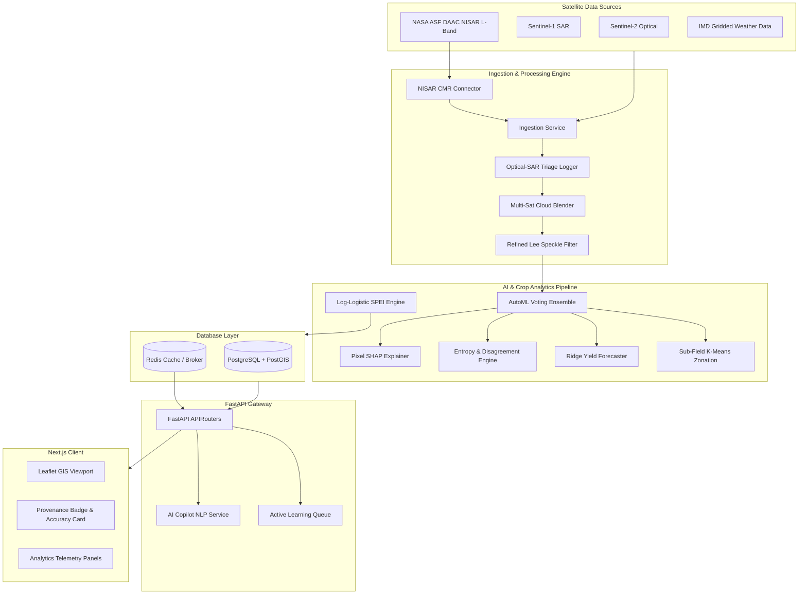

# 🌾 KISAN DRISHTI (किसान दृष्टि) 🛰️
### AI-Driven Satellite Crop Intelligence & Precision Irrigation Advisory Platform

[]()
[]()
[]()
[]()
[]()
[]()

**Kisan Drishti** is an enterprise-grade, nationally scalable geospatial AI platform designed to ingest multi-source optical (Sentinel-2, Landsat-8/9, MODIS) and microwave SAR (Sentinel-1, NISAR ready) satellite observations, detect regional moisture stress, classify crop species via an AutoML ensemble, and deliver precision irrigation advisories.

---

## 🌟 Key Innovations & Hackathon Differentiators

Our platform implements **20 high-fidelity agricultural remote sensing features** grouped into key operational themes:

### 🛡️ Theme A: Trust & Explainability (P0)
1. **Pixel-Level SHAP Explanations**: Attribution of AutoML classifier predictions to the 70 spectral-temporal features.
2. **Predictive Entropy Maps**: Visualizes classifier uncertainty zones using information entropy.
3. **Ensemble Model Disagreement**: Computes cosine similarity variance between Random Forest and XGBoost predictions.
4. **Causal Gating Explanations**: Suppresses maturity/senescence moisture stress false alarms using temporal VCI and SMI checks.

### ☀️ Theme B: Drought & Climate Intelligence (P1)
5. **Log-Logistic SPEI**: Standardized Precipitation Evapotranspiration Index calculated via 3-parameter fitting.
6. **NDVI Anomaly Z-Score Stacks**: Compares current NDVI against multi-year historical pixel statistics.
7. **Retrospective Lead-Time Scorer**: Validates early-warning lead-times against actual ground truth.

### 💰 Theme C: Economic Translation (P0/P1)
8. **Ridge Yield Forecaster**: Fuses growing-season cumulative NDVI integrals and GDD (Growing Degree Days).
9. **ROI Savings Engine**: Computes exact water volume and currency saved compared to traditional flood irrigation.
10. **Stage-Weighted Loss Estimator**: Fuses crop phenology stages with yield forecasts to output secure, SHA-256 encrypted evidence for PMFBY crop insurance claims.

### 🗺️ Theme D: Spatial Intelligence (P1/P2)
11. **Sub-Field K-Means Zonation**: Clusters pixel vectors into 2-4 management sub-zones.
12. **SAR Irrigated Extent Refinement**: Identifies discrepancies between administrative boundaries and actual satellite-detected irrigation boundaries.
13. **Crop Rotation Streak Tracker**: Identifies historical rotation sequences and fallow intervals.

### 📢 Theme E: Farmer-Facing Accessibility (P1/P2)
14. **Bilingual TTS Synthesizer**: Hindi/English audio synthesizers powered by `gTTS` for mobile delivery.
15. **Rain-Aware Advisory Deferral**: Automatically downgrades/defers irrigation depth recommendations based on 3-day rainfall forecasts.
16. **Active Learning Feedback Loops**: Captures farmer feedback and automatically prioritizes high-disagreement fields for retraining.

### ⚙️ Theme F: Operational Robustness (P0/P1)
17. **Optical-SAR Fallback Triage**: Automatically switches to radar-only parameters under heavy cloud cover.
18. **Multi-Satellite Cloud Blending**: Fuses overlapping optical assets using temporal cloud weight profiles.
19. **Ground Truth Data Provenance**: Displays badge indicators indicating whether metrics are generated against synthetic or real ground truth.

### 🚀 Theme G: Scale & Extensibility (P0/P1/P2)
20. **NASA ASF DAAC NISAR Connector**: Active Common Metadata Repository (CMR) search queries targeting live L-band HH/HV granules.

---

## 🛠️ System Architecture



---

## 🚀 Installation & Quick Start

### Prerequisites
Make sure you have the following installed:
- **Docker** and **Docker Compose**
- **Python 3.11+**
- **Node.js 18+**

### Local Docker Stack Boot
```bash
# Clone the repository
git clone https://github.com/Daksh7785/AgriSat-Intelligence-Platform-ASIP-.git
cd AgriSat-Intelligence-Platform-ASIP-

# Build and start the services in background
docker-compose up --build -d
```

### Access Ports
- 🖥️ **Web Client**: [http://localhost:3000](http://localhost:3000)
- ⚙️ **API Gateway**: [http://localhost:8000/docs](http://localhost:8000/docs) (Interactive Swagger Docs)
- 🗄️ **Database (PostGIS)**: `localhost:5432` (User/Password: `postgres`/`postgres`)

---

## 📡 API v1 Endpoint Overview

The platform exposes standard RESTful endpoints under `/api/v1/`:

| Section | Endpoint | Description |
| :--- | :--- | :--- |
| **Trust** | `GET /explain/{field_id}/why` | SHAP explainability reports. |
| | `GET /uncertainty/{command_area}/map` | Entropy and model disagreement layers. |
| **Climate** | `GET /drought/{command_area}/spei` | Log-Logistic SPEI index values. |
| **Economic** | `GET /yield/{field_id}/forecast` | Cumulative NDVI + GDD Ridge yield forecasts. |
| | `GET /roi/{field_id}/season-savings` | Volumetric and cash ROI water savings. |
| **Spatial** | `GET /zonation/{field_id}/zones` | K-Means sub-field management zones. |
| | `GET /rotation/{field_id}/history` | Crop rotation sequence tracking. |
| **Farmers** | `GET /voice/{field_id}/audio` | Bilingual gTTS audio advisory downloads. |
| | `POST /feedback/submit` | Farmer followed/wrong advisory logging. |
| | `GET /feedback/review-queue` | Active learning prioritization list. |
| **Robustness** | `GET /data-quality/{ca}/triage-log` | Cloud-cover triage telemetry. |
| **Onboarding**| `POST /onboarding/new-command-area` | Onboard and seed a custom command area. |

---

## 🧪 Running Unit Tests
Validate all 40 core algorithms, services, and endpoints:
```bash
# Run pytest
python -m pytest
```

---

## 🌾 PMFBY Insurance Claim Data Integrity
All stage-weighted yield-loss evaluations automatically generate a secure metadata package containing:
- **Timestamp**
- **Field & Crop IDs**
- **Loss Estimates**
- **SHA-256 Verification Hash** (used for tamper-proof auditing)