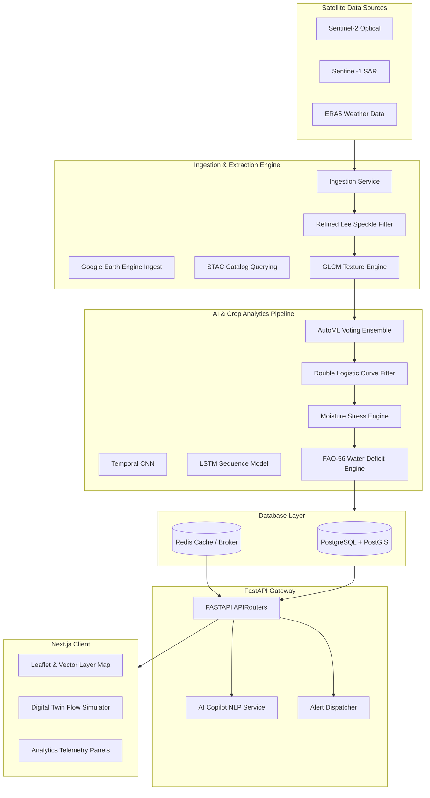

# AgriSense AI Platform
### Automated Crop Type Classification, Moisture Stress Detection & Precision Irrigation Advisory Platform

AgriSense AI is an enterprise-grade geospatial AI intelligence platform designed to ingest optical (Sentinel-2, Landsat-8/9) and microwave SAR (Sentinel-1) satellite observations, compute crop water demand metrics (FAO-56 Chapter 3 Penman-Monteith ET0, crop-coefficient-calibrated depletion values), detect regional moisture stress, classify crop species via an AutoML ensemble, and deliver precision irrigation advisories.

---

## 1. System Architecture



---

## 2. Installation Guide

### Prerequisites
Ensure your local development environment has the following installed:
- **Docker** and **Docker Compose**
- **Node.js 18+** (for running frontend outside Docker)
- **Python 3.12** (for running backend outside Docker)

### Local Docker Stack Startup
To boot up the complete environment (PostGIS database, Redis broker, FastAPI application server, Celery worker, Celery beat, and Next.js frontend):

1. **Clone and navigate to the project directory**:
   ```bash
   cd AgriSat-Intelligence-Platform-ASIP-
   ```

2. **Boot the Docker Compose Services**:
   ```bash
   docker-compose up --build -d
   ```

3. **Verify running containers**:
   ```bash
   docker-compose ps
   ```

4. **Access the Applications**:
   - **Frontend (Next.js)**: [http://localhost:3000](http://localhost:3000)
   - **Backend API (FastAPI Docs)**: [http://localhost:8000/docs](http://localhost:8000/docs)
   - **Database (PostgreSQL/PostGIS)**: Host `localhost`, Port `5432`, Username `postgres`, Password `postgres`.

---

## 3. API Documentation Reference

The backend exposes the following API routes at prefix `/api/v1`:

### Authentication (`/auth`)
* `POST /auth/signup` - Register a new operator user account.
* `POST /auth/login` - Authenticate credentials and return a JWT bearer token.
* `GET /auth/me` - Fetch profile metadata of the current active user.

### Ingestion & Processing (`/ingest`, `/features`)
* `POST /ingest/trigger` - Request asynchronous raster acquisition over a bounding box.
* `POST /features/extract` - Clip raster bands to field boundaries and calculate zonal indices.
* `POST /features/phenology/fit` - Curve-fit seasonal NDVI arrays using double logistic functions.

### AI Classification & Stress Engine (`/classification`, `/stress`, `/water`)
* `POST /classification/predict` - Run AutoML voting classifier to identify field crop types.
* `GET /classification/history/{field_id}` - Query historical field classifications.
* `POST /stress/analyze` - Calculate moisture stress level (1 to 5) combining optical, SAR, and thermal anomalies.
* `GET /stress/reports` - Generate village-level crop health priority reports.
* `POST /water/deficit` - Compute FAO-56 evapotranspiration ($ET_0, ET_c, ET_a$) and net water requirement.

### Advisories, Copilot, Alerts (`/advisory`, `/copilot`, `/alerts`)
* `POST /advisory/generate` - Produce stage-based watering advice (depth, volume, water savings).
* `GET /advisory/list/{field_id}` - Retrieve historic field advisory entries.
* `POST /copilot/query` - Convert text queries to structured PostGIS SQL & GeoJSON maps.
* `GET /alerts/list` - Fetch current active system alerts (unread/read).
* `POST /alerts/read/{alert_id}` - Acknowledge warning message.

---

## 4. Production Configuration & Scaling

### Database Tuning (PostGIS/TimescaleDB)
Add the following options to `postgresql.conf` for optimization with large GIS data layers:
```ini
shared_buffers = 4GB                  # 25% of system RAM
work_mem = 64MB                       # Fast complex joins
maintenance_work_mem = 512MB          # Fast GIS index generation
effective_cache_size = 12GB
random_page_cost = 1.1                # Fast SSD seek simulation
```

### Redis Caching Policies
For running the AI Copilot and Dashboard endpoints, configure Redis memory eviction policies in `/etc/redis/redis.conf`:
```conf
maxmemory 2gb
maxmemory-policy allkeys-lru
```

---

## 5. Monitoring & Logging Stack

- **FastAPI Logs**: Out-of-the-box logs are outputted to standard out via Uvicorn. To forward to files, uvicorn can be started with logging configurations:
  ```bash
  uvicorn app.main:app --log-config logging.conf
  ```
- **Celery Monitoring**: Inspect celery workers using the flower dashboard:
  ```bash
  pip install flower
  celery -A app.tasks.celery_app.celery_app flower --port=5555
  ```
- **Prometheus & Grafana**: Connect Prometheus to the FastAPI gateway metrics exporter (`prometheus-fastapi-instrumentator`) on `/metrics` to log API latency and SQL queries.

---

## 6. Hackathon Differentiators

1. **AI Agronomist Agent (Copilot)**: Integrates natural language processing with PostGIS filters to translate unstructured commands (e.g. *"Show stressed wheat fields"*) into map-drawn GeoJSON layers.
2. **Digital Twin Canal Network**: Model canal junctions as node-edge vectors to dynamically calculate inflow/outflow balances and priority zones.
3. **Multi-Satellite Fusion Speckle Filtering**: The system utilizes a vectorized Refined Lee Filter to clean SAR backscatter spikes ($VV$ and $VH$), fusing radar returns with optical indices ($NDVI, NDWI$) to provide cloud-free soil moisture estimates ($SMI$) during monsoon seasons.